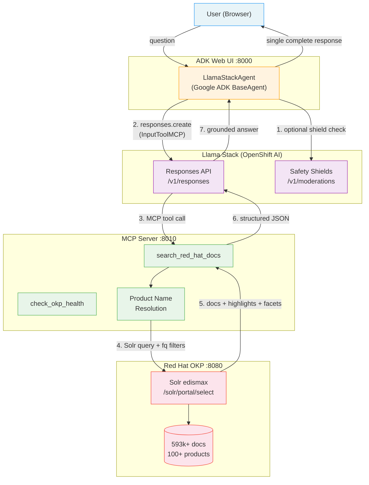

# rhokp-agent

Use the **Red Hat Offline Knowledge Portal (OKP)** with AI agents: retrieve Red Hat documentation and feed it to an LLM (e.g. [Llama Stack](https://github.com/red-hat-data-services/llama-stack)) for grounded, documentation-backed answers.

> This project is community tooling and is not officially supported by Red Hat.

## Features

- **OKP retrieval client** -- Typed, async-capable client with connection pooling, circuit breaker, Solr query injection protection, HTML entity decoding, and structured results aligned with OKP's tuned edismax configuration.
- **Product/version filtering** -- Filter search results by Red Hat product, documentation version, or document kind. Product names are auto-resolved (e.g. "Ansible" resolves to "Red Hat Ansible Automation Platform").
- **Faceted results** -- Every search returns product, document kind, and version facet counts for result distribution awareness.
- **MCP server** -- `search_red_hat_docs` and `check_okp_health` tools via [FastMCP](https://gofastmcp.com) (`pip install rhokp[mcp]`). Product names from the Solr index are cached at startup for fuzzy filter resolution.
- **ADK agent** -- Google ADK `BaseAgent` backed by Llama Stack Responses API with browser-based chat UI. Always calls the OKP search tool before responding.
- **Observability** -- Structured JSON logging with request-id correlation and timing; optional OpenTelemetry tracing (`pip install rhokp[observability]`).

No secrets or internal URLs are stored in the repo; configuration is via environment variables (see [.env.example](.env.example)).

## Prerequisites

- **Python 3.10+**
- **OKP instance** -- Run locally via Podman or deployed on OpenShift. Requires a `registry.redhat.io` subscription and an `ACCESS_KEY` for encrypted content.
- **Llama Stack endpoint** (for the ADK agent only) -- e.g. deployed on OpenShift AI.

## Quick start

### Full stack (OKP + MCP server + ADK agent)

```bash
git clone https://github.com/rrbanda/rhokp-agent.git
cd rhokp-agent

cp .env.example .env
# Edit .env -- set ACCESS_KEY and LLAMA_STACK_BASE_URL

podman-compose up
```

| Service    | URL                        |
|------------|----------------------------|
| OKP (Solr) | http://localhost:8080      |
| MCP server | http://localhost:8010/mcp  |
| ADK web UI | http://localhost:8000      |

### Standalone CLI

```bash
pip install -e .

podman run --rm -p 8080:8080 --memory=4g \
  -e ACCESS_KEY=<your_access_key> -e SOLR_MEM=1g \
  -d registry.redhat.io/offline-knowledge-portal/rhokp-rhel9:latest

rhokp "install OpenShift"
rhokp "install OpenShift" --product "OpenShift Container Platform" --rows 10
rhokp "kernel tuning" --kind documentation --context-only
```

## Python API

```python
from rhokp import retrieve, aretrieve, OKPClient, OKPError

# One-shot (creates/closes a client per call):
result = retrieve("install OpenShift", rows=5)
print(result.context)          # numbered snippets for LLM prompts
print(result.num_found)        # total Solr hits
print(result.facets.products)  # {"OpenShift Container Platform": 1447, ...}
for doc in result.docs:
    print(doc.title, doc.product, doc.score)

# With product/version filtering:
result = retrieve(
    "bare metal install",
    product="OpenShift Container Platform",
    version="4.16",
    document_kind="documentation",
)

# Persistent client (recommended for servers):
with OKPClient() as client:
    r1 = client.retrieve("install OpenShift")
    r2 = client.retrieve("configure networking", product="OpenShift Container Platform")

# Async:
result = await aretrieve("install OpenShift")
```

## MCP server

```bash
pip install rhokp[mcp]
rhokp-mcp
```

The server starts on `http://0.0.0.0:8010/mcp` by default. Override with `MCP_HOST` and `MCP_PORT` environment variables. See [docs/running.md](docs/running.md) for details on registering with Llama Stack.

## ADK agent

```bash
pip install rhokp[adk]
adk web agent/
```

The ADK web UI opens at `http://localhost:8000`. It uses the `LlamaStackAgent` (a Google ADK `BaseAgent`) that delegates reasoning and tool calling to Llama Stack's Responses API. MCP tools are passed inline -- no server-side tool registration is needed.

The agent always calls `search_red_hat_docs` before answering, grounding every response in official Red Hat documentation. Product name resolution ensures approximate names (e.g. "Ansible") are mapped to exact indexed names (e.g. "Red Hat Ansible Automation Platform").

Requires `LLAMA_STACK_BASE_URL` and `MCP_SERVER_URL` environment variables (see `agent/.env.example`).

### Verified prompts

All tested prompts call the OKP search tool and return documentation-grounded answers:

| Prompt | Product resolved | Result |
|--------|-----------------|--------|
| What is an execution environment? | Red Hat Ansible Automation Platform | Grounded answer with source citations |
| How do I install OpenShift on bare metal? | OpenShift Container Platform | Step-by-step from docs |
| What is systemd? | Red Hat Enterprise Linux | RHEL-specific answer |
| How to configure RHEL 9 firewall? | Red Hat Enterprise Linux | firewalld configuration from docs |
| What is pod crashing issue in OpenShift? | OpenShift Container Platform | Troubleshooting guidance |
| How to use Ansible playbooks? | Red Hat Ansible Automation Platform | Playbook usage from docs |
| What is Red Hat Satellite? | Red Hat Satellite | Product overview from docs |
| How to create a route in OpenShift? | OpenShift Container Platform | Route creation steps |
| What is SELinux? | Red Hat Enterprise Linux | SELinux overview from docs |
| How to deploy an application on OpenShift? | OpenShift Container Platform | Deployment tutorial references |

## Deployment

**Local:** `podman-compose up` runs OKP, MCP server, and ADK web UI on a shared network. See [docs/running.md](docs/running.md).

**OpenShift:** Kustomize manifests in `deploy/openshift/` deploy all three services with TLS Routes and Kubernetes Secrets. See [deploy/README.md](deploy/README.md).

## Repository layout

| Path | Description |
|------|-------------|
| [src/rhokp/](src/rhokp/) | Core retrieval library: models, config, client, backends, adapters |
| [src/rhokp/mcp/](src/rhokp/mcp/) | MCP server exposing OKP search tools |
| [agent/](agent/) | Google ADK agent backed by Llama Stack Responses API |
| [tests/](tests/) | Pytest test suite (206 tests) |
| [containers/](containers/) | Container images for MCP server and ADK agent |
| [deploy/](deploy/) | OpenShift/Kubernetes deployment manifests (Kustomize) |
| [eval/](eval/) | Retrieval evaluation (Precision@k, MRR) |
| [docs/](docs/) | Architecture, deployment, and configuration guides |

## Architecture



### Data flow

1. User asks a question in the ADK web UI.
2. `LlamaStackAgent` extracts the message and optionally runs input shield moderation.
3. Agent calls Llama Stack `responses.create()` with `InputToolMCP` pointing to the MCP server.
4. Llama Stack autonomously calls `search_red_hat_docs` via MCP.
5. MCP server resolves approximate product names to exact indexed names, queries OKP Solr.
6. Solr returns documentation excerpts with highlights, facets, and metadata.
7. Llama Stack synthesizes a grounded answer from the tool results.
8. Agent yields a single complete ADK Event with the full response text.

See [docs/architecture.md](docs/architecture.md) for the full design decisions.

## Running tests

```bash
pip install -e ".[mcp,dev]"
pytest tests/ -v --cov=rhokp
```

Tests for framework-specific integrations are skipped when their optional dependencies are not installed.

## Contributing

See [CONTRIBUTING.md](CONTRIBUTING.md).

## License

Apache-2.0. See [LICENSE](LICENSE).
